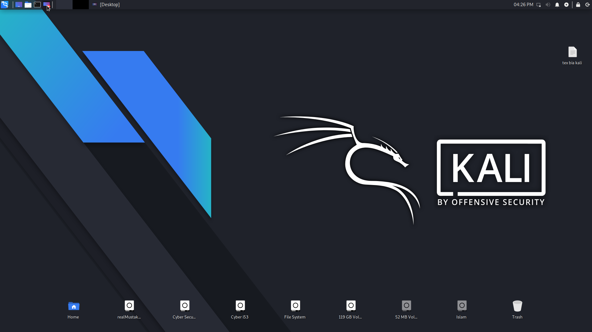

<!-- kaliLinux -->

<p align="center">
 
</p>


<p align="center">Kali advanced command and more information</p>

##

### Features
- Hack
- Linux
- Tools

##

### Kali Linux all Commands

> `Setup IP Address`
```
$ sudo ifconfig (cardName) ip address
$ sudo ifconfig (cardName) netmask netmaskAddress
$ sudo ifconfig (cardName) broadcast broadcastAddress
```

##

### Installation
```
$ apt install git
$ git clone https://github.com/Cyberi53/kaliLinux
$ cd kaliLinux
$ ls
```


### Supported Platform
**`kaliLinux`**

##

<h3 align="center">
:: How it works! ::
</h3>
<p align="center">

</p>

##

### Disclaimer :
<p>This Python tool are completely free! Not intended for sale. Thanks!!</p>

##

### Special Thanks :

- [**AWWB**](https://facebook.com/awwbFoundation)
- [**jk -iTGuru**](https://github.com/jk-iTGuru)
- [**jkTECHDoctor**](https://github.com/jkTECHDoctor)
- [**Abdullah**](#)
- [**Emamul**](#)
- [**Freelancer Mustakin**](https://github.com/freelancermustakin)

##

### Donate!
> Donate a little money for helpless oppressed Muslims. The money you donate will only be used for Islam, InshaAllah.
- awwbFoundation (Donation)
  - `bKash: +8801944799794`
  - `Rocket: +8801944799794`
  - `Telegram: @contactAWWBfoundation`

> Or talk to Freelancer Mustakin, the founder of Cyber ​​I53. `via fb: www.facebook.com/freelancermustakin`

##

### Follow @Cyberi53
<a href="https://github.com/Cyberi53"></a>
<a href="https://facebook.com/Cyberi53"></a>
<a href="https://t.me/Cyber_i53"></a>
<a href="https://m.youtube.com/channel/UCoAUatLl3PQB-buaTMn8YJw"></a>
